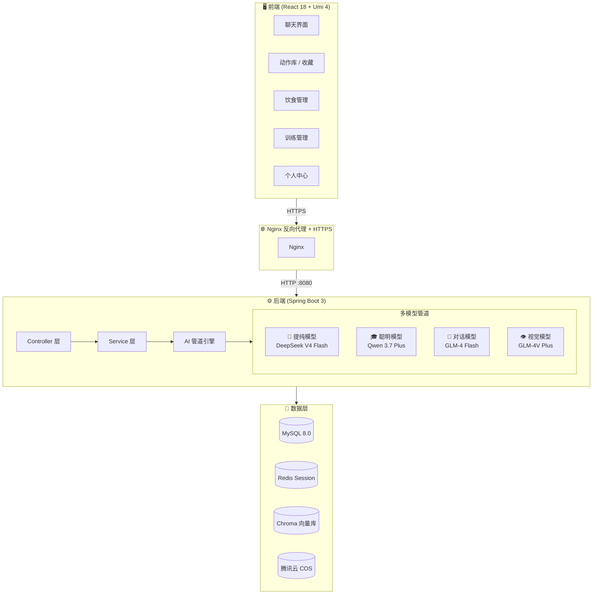

<div align="center">

# 🏋️ Fitness-Web

### AI 智能健身助手 — 多模型驱动的全栈健身管理平台

**Spring Boot 3 · React 18 · 多模型 AI 管道 · RAG 知识库 · Docker 部署**

[](https://openjdk.org/)
[](https://spring.io/projects/spring-boot)
[](https://react.dev/)
[](https://www.mysql.com/)
[](https://www.docker.com/)
[]()

**[在线体验](https://zhouzhou.cn)** · **[功能截图](#-功能演示)** · **[快速部署](#-快速开始)**

</div>

---

## 📖 目录

- [项目简介](#-项目简介)
- [核心亮点](#-核心亮点)
- [系统架构](#-系统架构)
- [技术栈](#-技术栈)
- [核心功能](#-核心功能)
- [项目结构](#-项目结构)
- [快速开始](#-快速开始)
- [环境变量](#-环境变量)
- [安全说明](#-安全说明)
- [开发日志](#-开发日志)

---

## ✨ 项目简介

Fitness-Web 是一款**多模型 AI 驱动**的智能健身助手平台。通过自然语言对话，用户可以管理训练计划、记录饮食运动、拍照识别食物和器械、获取个性化健身建议。

AI 教练 **"Tatan"** 采用**分层管道架构**：提纯模型负责意图分析 + 工具调度，聪明模型负责高质量回复生成，对话模型处理日常闲聊，视觉模型处理图片理解——四大模型协同工作，兼顾响应速度与回复质量。

---

## 🌟 核心亮点

- 🧠 **多模型 AI 管道** — 提纯 → 聪明 → 对话 → 视觉，四模型分工协作，支持用户自选模型
- 🔍 **视觉识别** — 拍照识别食物热量 / 器械动作推荐，视觉模型先分类再精准分发
- 🎙️ **语音输入** — 语音转文字后走对话链路，解放双手
- 📊 **用户画像系统** — 自动从对话中提取身高/体重/目标/偏好，提供个性化建议
- 🌤️ **天气感知** — 根据实时温湿度给出训练建议（如闷热天推荐室内训练）
- 📋 **智能训练计划** — Markdown 表格格式的结构化训练方案，含组数/次数/节奏
- 🥗 **精准饮食分析** — 基于 USDA 食物数据库的营养素计算，Macro 表格一目了然
- 🔄 **计划循环系统** — 训练/饮食模板 + 周期循环，自动排期
- 💾 **向量知识库** — Chroma + RAG 检索增强，回答专业健身问题

---

## 🏗️ 系统架构



---

## 🛠️ 技术栈

| 分类 | 技术 | 说明 |
|------|------|------|
| **后端框架** | Spring Boot 3.x + MyBatis-Plus | RESTful API，统一异常处理 |
| **前端框架** | React 18 + Umi 4 + Ant Design 5 | 响应式布局，移动端适配 |
| **AI - 对话** | Qwen 3.7 Plus | 高质量长文本生成（聪明模型） |
| **AI - 提纯** | DeepSeek V4 Flash | 快速意图识别 + 工具调度 |
| **AI - 闲聊** | GLM-4 Flash | 日常对话，低成本高速度 |
| **AI - 视觉** | GLM-4V Plus / Qwen VL Max | 图片理解，食物/器械识别 |
| **AI - 语音** | Qwen ASR Flash | 语音转文字 |
| **知识库** | Chroma 向量数据库 + Spring AI RAG | 健身专业知识检索增强 |
| **营养数据** | USDA FoodData Central | 食物营养素精准查询 |
| **数据库** | MySQL 8.0 | 业务数据持久化 |
| **缓存** | Redis | Session 管理 |
| **文件存储** | 腾讯云 COS | 头像 / 图片上传 |
| **天气 API** | OpenWeatherMap | 实时天气获取 |
| **部署** | Docker Compose + Nginx | 一键部署，HTTPS 证书 |

---

## 🎯 核心功能

### 💬 AI 智能教练对话
- **流式对话** — SSE 实时逐字输出，打字机效果
- **意图识别** — 10+ 意图自动分类（查计划/查记录/保存记录/生成计划/饮食记录/知识问答/闲聊…）
- **深度思索模式** — 开启后切换到聪明模型，回复更深入更专业
- **多模型自由切换** — 用户可在配置面板自选每个角色的模型（含自定义 OpenAI 兼容模型）
- **RAG 知识库** — 基于向量检索的健身专业知识问答
- **天气感知** — 根据用户所在城市实时温湿度给出训练建议

### 📸 拍照识别
- **食物识别** — 拍照自动识别食物种类，估算重量，计算热量和宏量营养素
- **器械识别** — 拍照识别健身器械，推荐匹配的训练动作，附 B站/抖音教学视频链接

### 🎙️ 语音输入
- **语音转文字** — 支持中文语音实时转文字，转写后自动进入对话链路

### 📋 训练管理
- **智能训练计划** — AI 生成 Markdown 表格格式的训练方案（含阶段/动作/组数/次数/节奏）
- **训练模板** — 自定义模板 + 循环周期，自动排期
- **动作库** — 150+ 动作，按肌群/难度/器械三维筛选
- **收藏功能** — 收藏动作，筛选逻辑与动作库完全同步
- **训练问题反馈** — 训练中遇到问题可反馈，AI 调整计划

### 🥗 饮食管理
- **智能饮食计划** — AI 生成四餐方案，标注热量/蛋白质/碳水/脂肪
- **精准营养计算** — 基于 USDA 数据库，含精度校验（宏量营养素总量必须等于目标）
- **一键记录** — 对话中"今天早餐吃了两个鸡蛋"直接保存饮食记录
- **同日合并** — 同一天同一餐次自动追加，不重复创建
- **营养摘要表格** — 每次记录显示 Markdown 表格（目标 vs 实际 vs 差值）

### 📊 数据追踪
- **体重趋势图** — 可视化体重变化曲线
- **训练日历** — 每日训练记录一览
- **饮食记录** — 完整的运动饮食历史
- **用户画像** — 自动从对话提取并更新（身高/体重/目标/健身经验等）

### 👤 用户系统
- 登录 / 注册 + 验证码
- 个人信息管理（身高/体重/年龄/健身目标）
- 头像上传（COS 云存储）
- 管理员后台（用户管理 / 食物管理 / AI 模型管理）

---

## 📁 项目结构

```
Fitness-Web/
├── Fitness-backend/                    # Spring Boot 后端
│   ├── src/main/java/com/zz/usercenter/
│   │   ├── controller/                 # 接口层 (11 个 Controller)
│   │   │   ├── ChatController          #   对话/流式/语音/图片识别
│   │   │   ├── ModelController         #   模型列表/切换/配置
│   │   │   ├── ExerciseController      #   动作库查询
│   │   │   ├── UserController          #   用户/收藏/画像
│   │   │   ├── HealthRecordController  #   运动/饮食记录
│   │   │   └── ...                     #   训练/饮食/知识/食物
│   │   ├── service/                    # 业务层 (17 个 Service)
│   │   │   ├── impl/ChatServiceImpl    #   AI 管道核心 (5000+ 行)
│   │   │   └── ...
│   │   ├── config/                     # AI 模型配置/跨域/COS/WebSocket
│   │   ├── common/                     # 工具类/异常/语音转写
│   │   └── model/                      # 实体/请求/VO
│   └── src/main/resources/
│       ├── application.yml             # 开发配置
│       ├── application-prod.yml        # 生产配置 (.gitignore)
│       └── application.example.yml     # 配置模板
│
├── Fitness-frontend/                   # React 前端
│   └── src/
│       ├── pages/                      # 页面
│       │   ├── user/chat.tsx           #   AI 对话页 (1800+ 行)
│       │   ├── exercises.tsx           #   动作库页
│       │   ├── user/favorites.tsx      #   收藏页
│       │   └── ...
│       ├── components/                 # 通用组件
│       ├── constants/                  # 常量 (肌群/器械/筛选)
│       ├── hooks/                      # 自定义 Hooks
│       ├── services/                   # API 调用
│       └── assets/icons/               # 自定义 SVG 图标
│
├── nginx/                              # Nginx HTTPS 配置
├── docker-compose.example.yml          # Docker 部署模板
├── CLAUDE.md                           # AI 协作编码规范
└── README.md
```

---

## 🚀 快速开始

### 环境要求

| 依赖 | 版本 | 说明 |
|------|------|------|
| JDK | 17+ | 后端运行时 |
| Node.js | 18+ | 前端构建 |
| MySQL | 8.0+ | 数据库 |
| Redis | 6.0+ | Session 缓存 |
| Chroma | 0.4+ | 向量数据库（可选） |

### 1. 克隆项目

```bash
git clone https://github.com/Zz-1234566/FitnessWeb.git
cd FitnessWeb
```

### 2. 配置后端

```bash
cd Fitness-backend

# 复制配置模板
cp src/main/resources/application.example.yml src/main/resources/application.yml

# 编辑 application.yml，填入真实的数据库连接和 API Key
# 详见下方「环境变量」章节
```

### 3. 初始化数据库

```bash
# 创建数据库
mysql -u root -p -e "CREATE DATABASE ZZ DEFAULT CHARACTER SET utf8mb4;"

# 执行表结构和数据迁移
mysql -u root -p ZZ < sql/update_equipment_array.sql
```

### 4. 启动后端

```bash
./mvnw spring-boot:run
# 后端运行在 http://localhost:8080/api
```

### 5. 启动前端

```bash
cd ../Fitness-frontend

npm install
npm run dev
# 前端运行在 http://localhost:8000
```

### 6. Docker 部署（生产环境）

```bash
# 参考模板创建 docker-compose.yml
cp docker-compose.example.yml docker-compose.yml

# 编辑 docker-compose.yml，填入环境变量
docker compose up -d
```

---

## 🔑 环境变量

| 变量名 | 必填 | 说明 |
|--------|------|------|
| `QWEN_API_KEY` | ✅ | 通义千问 API Key（DashScope） |
| `DEEPSEEK_API_KEY` | ✅ | DeepSeek API Key |
| `GLM_API_KEY` | ✅ | 智谱 AI API Key |
| `COS_SECRET_ID` | ✅ | 腾讯云 COS SecretId |
| `COS_SECRET_KEY` | ✅ | 腾讯云 COS SecretKey |
| `USDA_API_KEY` | ✅ | USDA FoodData Central API Key |
| `OWM_API_KEY` | ❌ | OpenWeatherMap API Key（天气功能） |
| `MYSQL_ROOT_PASSWORD` | ❌ | MySQL 密码（生产环境） |
| `AI_CRYPTO_SECRET` | ❌ | 自定义模型 API Key 加密密钥 |
| `REDIS_HOST` | ❌ | Redis 地址（默认 localhost） |

---

## 🔐 安全说明

- 所有 API Key、数据库密码、云存储密钥通过**环境变量**注入，不存入代码仓库
- `application.yml` 仅包含 `${ENV_NAME}` 占位符
- `application-prod.yml` 生产配置在 `.gitignore` 中排除
- 自定义模型的 API Key 使用 AES 对称加密存储
- 用户密码 BCrypt 加密

---

## 📝 开发日志

### ✅ 已完成

<details>
<summary>点击展开完整功能清单</summary>

**用户系统**
- [x] 注册 / 登录 + 验证码
- [x] 个人信息管理（身高/体重/年龄/健身目标）
- [x] 头像上传（腾讯云 COS）
- [x] 管理员后台（用户管理 / 食物管理）
- [x] 用户画像自动提取（从对话中提取健身偏好）

**AI 对话**
- [x] SSE 流式对话
- [x] 多模型 AI 管道（提纯 → 聪明 → 对话 → 视觉）
- [x] 10+ 意图自动识别与分发
- [x] 深度思索模式（切换到聪明模型）
- [x] 用户自选模型（含自定义 OpenAI 兼容模型）
- [x] RAG 向量知识库检索增强
- [x] 天气感知训练建议

**视觉 & 语音**
- [x] 拍照识别食物（热量 + 宏量营养素计算）
- [x] 拍照识别器械（匹配动作推荐 + 视频链接）
- [x] 语音转文字输入

**训练管理**
- [x] AI 智能训练计划（Markdown 表格格式）
- [x] 训练模板 + 周期循环
- [x] 150+ 动作库（肌群/难度/器械三维筛选）
- [x] 收藏功能（筛选与动作库同步）
- [x] 训练问题反馈与计划调整

**饮食管理**
- [x] AI 智能饮食计划（四餐方案 + 精准营养计算）
- [x] 一键记录（对话中直接保存）
- [x] 同日同餐自动合并
- [x] 营养摘要表格（目标 vs 实际 vs 差值）
- [x] 食物库（系统 + 自定义，USDA 数据源）

**数据追踪**
- [x] 体重趋势图
- [x] 训练日历
- [x] 运动/饮食记录历史

**部署**
- [x] Docker Compose 一键部署
- [x] Nginx HTTPS 反向代理

</details>

---

<div align="center">

**Made with ❤️ by Zz**

</div>
